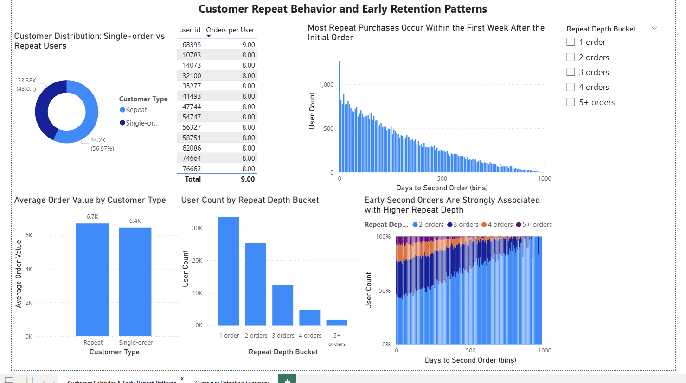

# Customer Retention Cohort Analysis (Power BI)

## Business Problem
Understanding customer retention is critical for sustainable business growth. This project analyzes user cohorts to identify retention patterns and potential churn risks.

## Analysis
Cohort analysis was used to examine how customer retention changes over time.

Key metrics analyzed:

- Customer retention rate
- Cohort performance over time
- Customer lifecycle patterns

## Dashboard

You can view the interactive Power BI dashboard here:

[View the Power BI Dashboard](https://drive.google.com/drive/folders/1aEGyZUROqVUm55hNA9H6GlTLAu3F6taW?usp=sharing)

## Dashboard Preview

## Tools
- Power BI
- Data visualization
- Business analytics

## Skills Demonstrated
- Cohort analysis
- Customer retention analysis
- Data visualization
- Business problem solving
